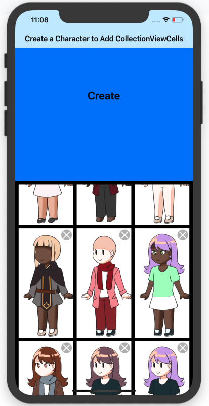

# RPG Character Creator
Design your own RPG-styled character!

## Appdev Hack Challenge Fall 2019 Team Members
* Ethan Keane Siapno (iOS/Backend)
* Christopher Janas (Backend)
* Akane Edwards (iOS/Asset Designer)

## Our App
Create and view RPG-styled characters created by users. With no characters the screen looks like so:

Let's fix this by adding characters to our screen by tapping on the big, blue "Create" Button. This navigates us to the page where users may create a character. Use the arrows at the top to choose which aspect of your character you want to change. Users are able to customize characters outfits, eyes, hairstyles, and among many other assets. 

When users are satisfied with their creations, they can hit the "save" button in the top right in order to add their new RPG character to the UICollectionView, for all other users to see. 

Swipe vertically on the UICollectionView to browse all user-created characters!

## Submitted Scope (for our graders)
All of the files used for the backend are in the folder named "backend" while all of the files for iOS are found in the folder named "CharacterCreator"
* iOS
    * Completed Requirements
        * Integrated custom API built by backend developers. The a timer is used to send a GET request every 5 seconds to reload the data on the UICollectionView. Also, anytime a character is saved, a POST request is successfully sent which adds the character to the database, allowing all others users to eventually see the new character.
        * Navigation through UINavigationController and UIBarButtonItems
        * Usage of a UICollectionView
        * AutoLayout achieved through NSLayoutConstraint
    * Unimplemented
        * Unfortunately, we were unable to get the DELETE request to work in order to delete a character and its respective UICollectionViewCell and data from the database. Aside from that, the rest of the app works just as intended. DELETE request do work from postman, however. And the deleted character will disappear from the collectionview as soon as the timer refreshes and reloads the data. Because of this, the "X" delete buttons at the top of every UICollectionViewCell are non-functional.
* Backend
    * Deployed the backend files to Docker and Google Cloud
        * External IP Address is found in the iOS folder, in CharacterCreator/CharacterCreator/NetworkManager.swift specifically.
    * Created GET, POST, and DELETE API routes, all fully functional, with database modeling in mind.
        * GET requests at:
            * **/characters/** - get all characters
            * **/character/<int:id>/** - get a specific character
        * POST request at:
            * **/character/** - create a create a character
            * **/character/<int:id>/** - edit a specific character
        * DELETE request at:
            * **/character/<int:id>/** - delete a specific character
        * All of these requests can be called from Postman and the results will show on any iOS device. For example, despite the fact that the DELETE request was not fully implemented on the iOS side, if you call a DELETE request from Postman, as soon as the iPhone device reloads (reload time is every 5 seconds), it will delete the character from the CollectionView, since the character will have been removed from the database.
            
